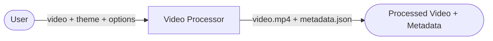
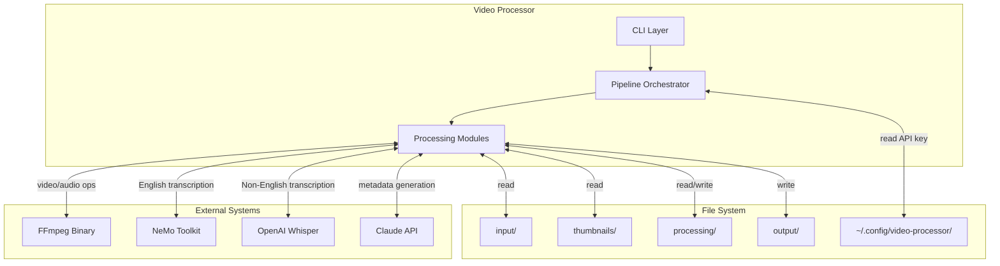

# 3. Context and Scope

## Business Context

Users provide source videos and receive fully processed videos ready for publication, complete with thumbnail overlays and generated metadata.

## Technical Context

## External Interfaces

### FFmpeg

- **Purpose**: Video/audio manipulation (extraction, trimming, concatenation)
- **Integration**: `ffmpeg-python` library wrapping CLI commands
- **Data Flow**: File paths in, processed files out

### NeMo Toolkit (Parakeet)

- **Purpose**: English speech-to-text transcription
- **Model**: `nvidia/parakeet-tdt-0.6b-v2`
- **Integration**: Python API, model cached globally
- **Data Flow**: Audio file path in, transcription text out

### OpenAI Whisper

- **Purpose**: Non-English speech-to-text transcription
- **Model**: Medium variant
- **Integration**: Python API, model cached globally
- **Data Flow**: Audio file path in, transcription text out

### Claude API

- **Purpose**: Generate video title and description from transcription
- **Integration**: LangChain with structured output (Pydantic model)
- **Data Flow**: Transcription text in, VideoMetadata object out
