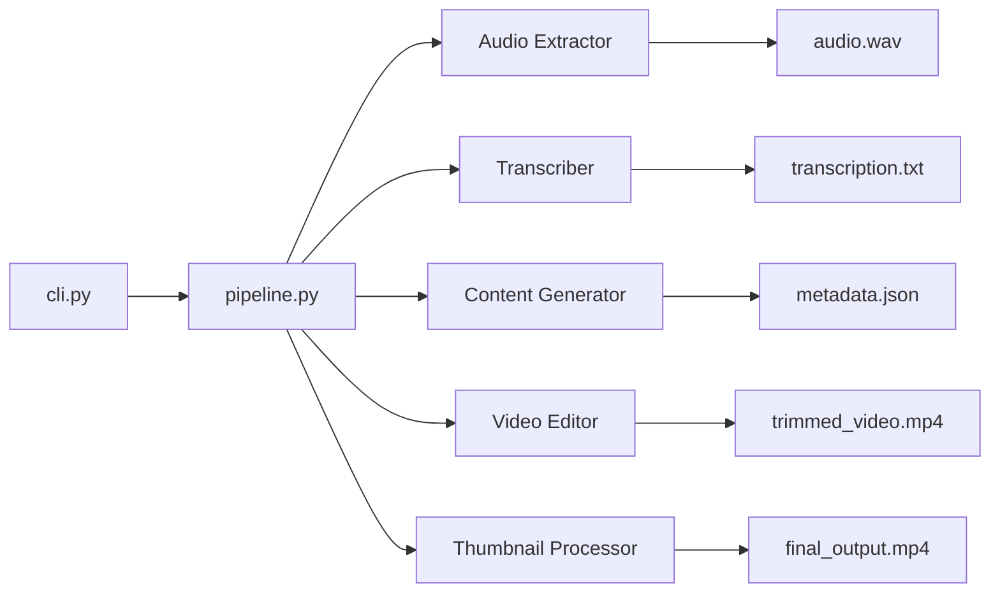
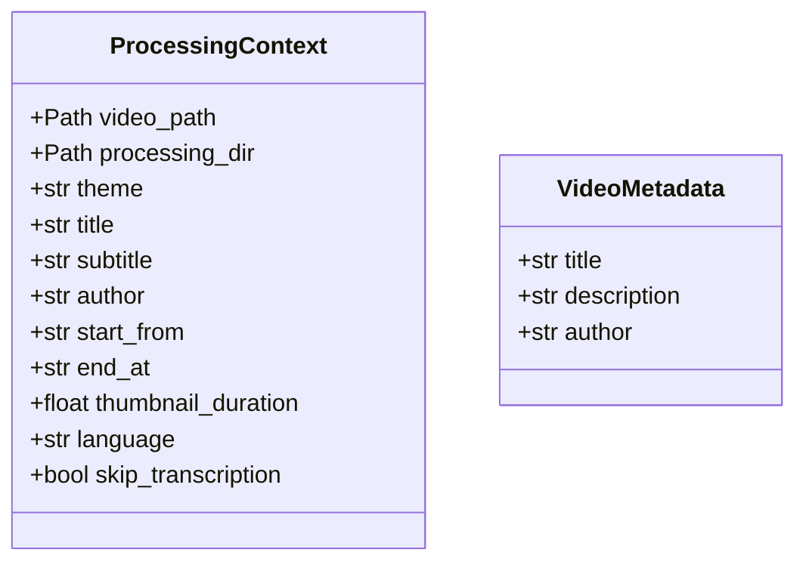

# 5. Building Block View

## Level 1: System Overview

## Level 2: Module Breakdown

### cli.py

**Responsibility**: User interface and argument handling

- Parses CLI arguments via Typer
- Validates input files and options
- Displays progress and results using Rich
- Entry point: `process` and `info` commands

### pipeline.py

**Responsibility**: Orchestration and state management

- Defines `ProcessingContext` dataclass (shared configuration)
- Implements `run_pipeline()` orchestrating all steps
- Step functions: `step_extract_audio`, `step_transcribe`, `step_generate_metadata`, `step_trim_video`, `step_add_thumbnail`
- Handles output file naming and copying

### audio_extractor.py

**Responsibility**: Audio extraction from video

- Function: `extract_audio(video_path, output_path)`
- Output: 16kHz mono WAV (PCM_S16LE)
- Uses: ffmpeg-python

### transcriber.py

**Responsibility**: Speech-to-text conversion

- Functions: `transcribe_audio(audio_path, language)`
- English: Nvidia Parakeet TDT model
- Other languages: OpenAI Whisper medium
- Features: Global model caching, GPU detection (CUDA/MPS/CPU)

### content_generator.py

**Responsibility**: AI-powered metadata generation

- Function: `generate_content_metadata(transcription, language)`
- Uses: LangChain + Claude with structured output
- Output: `VideoMetadata` (title, description, author)
- Loads prompts from `prompts/{lang}_system.md` and `prompts/{lang}_user.md`

### video_editor.py

**Responsibility**: Video trimming

- Function: `trim_video(video_path, output_path, start_from, end_at)`
- Uses: FFmpeg stream copy (no re-encoding)
- Validates: mm:ss timestamp format

### thumbnail_processor.py

**Responsibility**: Thumbnail creation and video prepending

- Function: `create_thumbnail_with_text(thumbnail_path, output_path, title, subtitle, width, height)`
- Function: `add_thumbnail_to_video(thumbnail_path, video_path, output_path, duration)`
- Uses: Pillow for image manipulation, FFmpeg for video concatenation
- Creates 5-second thumbnail video segment prepended to main video

## Data Model

