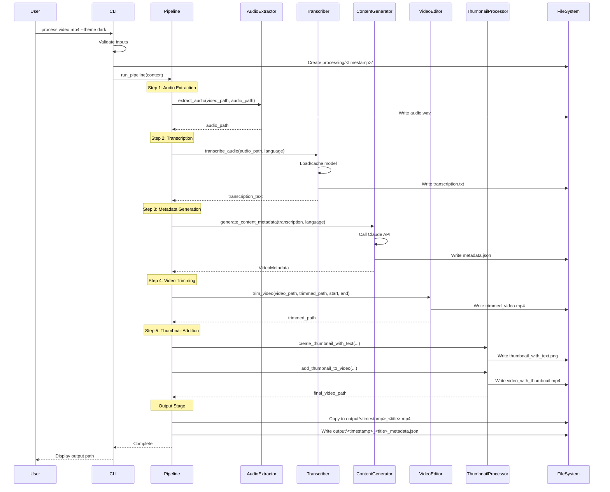
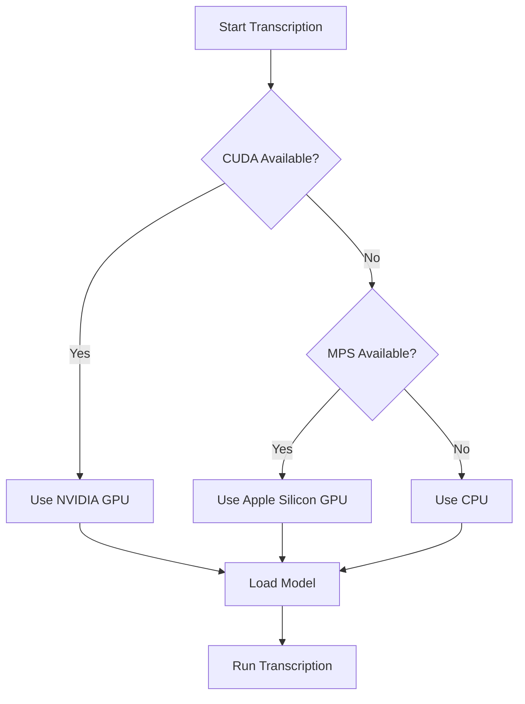
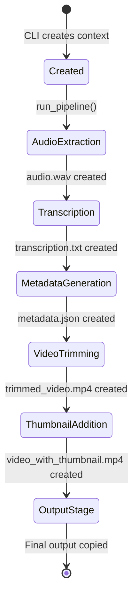

# 6. Runtime View

## Pipeline Execution



## Device Detection Flow

The transcriber automatically selects the best available compute device:



## ProcessingContext Lifecycle



## Intermediate Files

Each pipeline run creates a timestamped directory with all intermediate artifacts:

```
processing/20240115_143022/
├── audio.wav                    # Extracted audio (16kHz mono)
├── transcription.txt            # Raw transcription text
├── metadata.json                # Generated title/description
├── trimmed_video.mp4            # Video after trimming
├── thumbnail_with_text.png      # Thumbnail image with overlay
└── video_with_thumbnail.mp4     # Final video before copy
```

This enables debugging by inspecting any stage of the pipeline.
