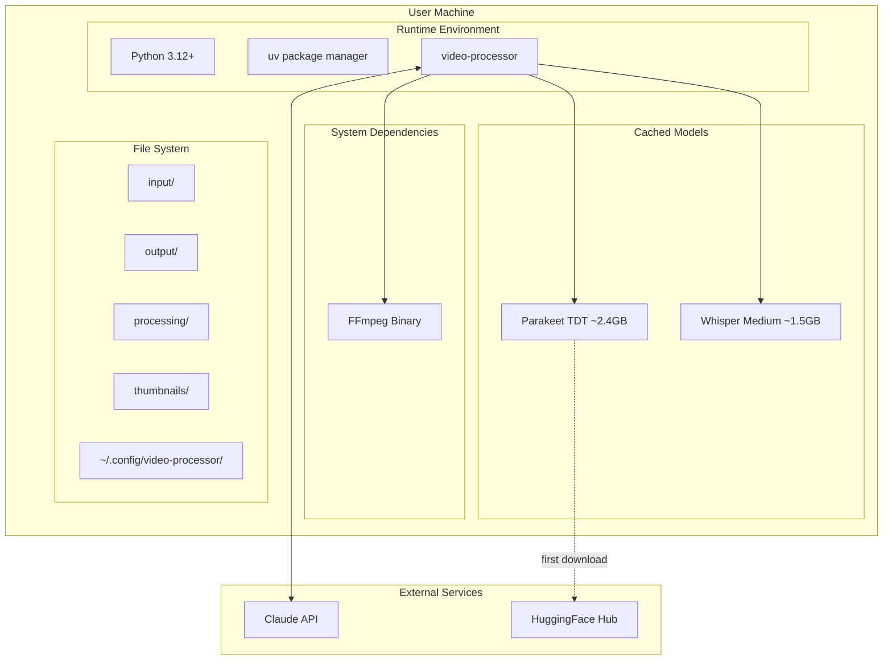

# 7. Deployment View

## System Requirements

| Requirement | Details |
|-------------|---------|
| Python | 3.12 or higher |
| FFmpeg | System installation required (`brew install ffmpeg` on macOS) |
| Storage | ~2.4GB for Parakeet model (downloaded on first run) |
| GPU (optional) | NVIDIA CUDA or Apple Silicon MPS for faster transcription |

## Installation

```bash
# Clone repository
git clone <repository-url>
cd video-processor

# Install dependencies with uv
uv sync
```

## Directory Structure

```
video-processor/
├── input/                      # Place source videos here
├── output/                     # Final processed videos
├── processing/                 # Timestamped intermediate files
│   └── <timestamp>/
│       ├── audio.wav
│       ├── transcription.txt
│       ├── metadata.json
│       ├── trimmed_video.mp4
│       └── ...
├── thumbnails/                 # Theme background images
│   ├── dark.jpg
│   └── light.png
└── src/video_processor/        # Source code
```

## Configuration

### API Key Setup

Create configuration file at `~/.config/video-processor/settings.json`:

```json
{
  "api_key": "sk-ant-..."
}
```

The API key is required for metadata generation using Claude.

### Theme Thumbnails

Place theme background images in the `thumbnails/` directory:

- Supported formats: `.jpg`, `.png`
- Naming: `<theme>.jpg` or `<theme>.png`
- The CLI `--theme` argument matches the filename (without extension)

## Deployment Diagram



## First Run

On first execution with transcription enabled:

1. Parakeet model downloads from HuggingFace (~2.4GB)
2. Model is cached globally for subsequent runs
3. GPU detection runs automatically (CUDA > MPS > CPU)

Subsequent runs skip the download and reuse the cached model.
